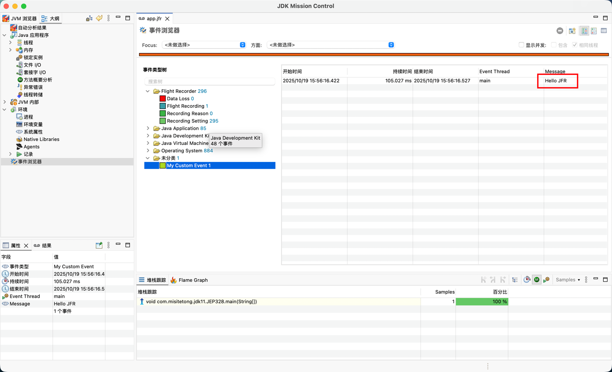
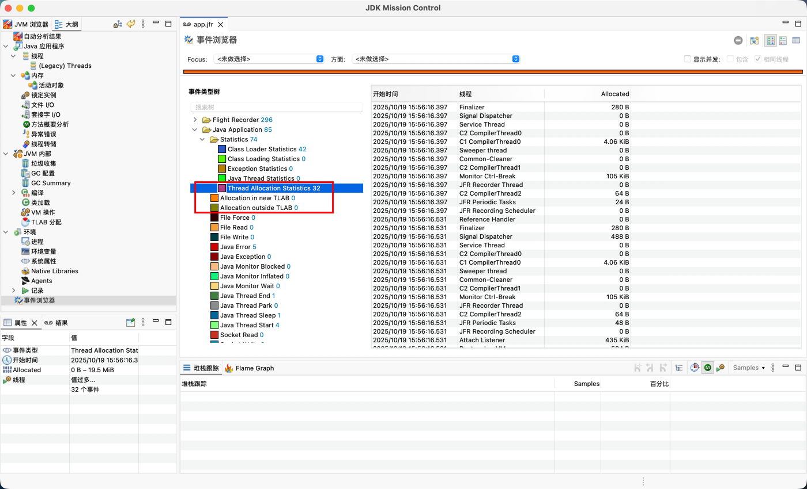

# JDK11 新特性

## [嵌套访问控制（JEP181）](https://openjdk.org/jeps/181)

### 背景

jvm允许一个源文件中放多个class。这对于用户是透明的，用户认为它们在一个class中，所以希望它们共享同一套访问控制体系。
因此在一个class中的类可以互相访问各自类的私有成员变量。
在JDK8中通过`INNERCLASS`来识别嵌套类，通过增加一个`static synthetic access`来实现私有变量的访问

```shell
# build module JDK8 with jdk8 first
cd path/to/class file/for/JDK8/src/main/java/com/misitetong/jdk11/JEP181.java
# for more details use "javap -verbose JEP181\$Nest2" or idea's plugin "Asm Bytecode Viewer"
javap -p JEP181\$Nest2 
```

```java
// result for javap
public class com.misitetong.jdk11.JEP181$Nest2 {
    private int nestVariable;
    public com.misitetong.jdk11.JEP181$Nest2();
    static int access$000(com.misitetong.jdk11.JEP181$Nest2);
}
```

### 缺点

1. 编译器通过增加`static synthetic access`方法来绕过JVM限制，这种方式和封装相违背，并且轻微的增加程序的大小，会干扰用户和工具。所以我们希望一种更直接，更安全，更透明的方式。
2. 这种绕过的方式不兼容反射，使用反射进行私有方法调用的时候会报错。而反射应该和源码级访问拥有相同权限，这种表现不一致的行为是有问题的。见`JDK11/src/main/java/com/misitetong/jdk11/JEP181.java`

### JEP181改进

1. 顶级类增加`NESTMEMBER`字段
2. 内部类增加`NESTHOST`字段，让jvm天然的知道嵌套关系，允许相同顶级类的类之间访问私有属性、方法
3. 修复了使用反射进行私有方法调用报错的问题，使其与源码级访问拥有相同权限

## [动态类文件常量（JEP309）](https://openjdk.org/jeps/309)

### 背景

在 JDK 8 之前，Java 的常量池项是固定几种类型：`CONSTANT_Integer`, `CONSTANT_String`, `CONSTANT_Class`, `CONSTANT_MethodHandle` 等等。
每种常量类型都要在类加载时一次性解析并存入内存。这些常量都是静态的、编译时确定的。但现实中，很多“逻辑上是常量”的值，无法在编译时确定，例如：

1. 从配置文件读取的字符串
2. 通过加密/哈希生成的密钥
3. 语言特性所需的运行时构造对象（如 lambda 表达式的实现类、模式匹配的谓词）

Java 7 引入的 invokedynamic 允许动态解析方法调用点，极大提升了动态语言（如 JRuby、Nashorn）在 JVM 上的性能。
JEP 309 将这一思想推广到“常量”领域：既然方法调用可以动态解析，为什么常量不能？

```shell
# build module JDK8 with jdk8 first
cd path/to/class file/for/JDK8/src/main/java/com/misitetong/jdk11/JEP309.java
javap -v JEP309
```

```text
// result for javap
static {};
    descriptor: ()V
    flags: (0x0008) ACC_STATIC
    Code:
      stack=3, locals=0, args_size=0
         0: new           #5                  // class java/lang/StringBuilder
         3: dup
         4: invokespecial #6                  // Method java/lang/StringBuilder."<init>":()V
         7: ldc           #7                  // String Hello World
         9: invokevirtual #8                  // Method java/lang/StringBuilder.append:(Ljava/lang/String;)Ljava/lang/StringBuilder;
        12: invokestatic  #9                  // Method java/lang/System.currentTimeMillis:()J
        15: invokevirtual #10                 // Method java/lang/StringBuilder.append:(J)Ljava/lang/StringBuilder;
        18: invokevirtual #11                 // Method java/lang/StringBuilder.toString:()Ljava/lang/String;
        21: putstatic     #3                  // Field MSG:Ljava/lang/String;
        24: return
      LineNumberTable:
        line 10: 0
```

使用JDK8编译后，查看`JEP309`的字节码文件可以看到，类加载的时候就通过`invokestatic`指令调用`java/lang/System.currentTimeMillis()`创建了字符串拼接后的结果。
字符串拼接使用的是`java/lang/StringBuilder.append()`

### 缺点

1. 如果想支持一种新的常量池类型（比如新的 lambda 表达式常量），必须修改 JVM 规范和类文件结构。
2. 每种常量类型都要在类加载时一次性解析并存入内存。哪怕程序运行过程中根本没用到，也会提前加载。这导致应用启动慢、内存占用大。

### JEP309改进

动态类文件常量的核心思想是将常量的解析延迟到运行时，而不是在编译时确定。这为动态语言特性和运行时优化提供了更大的灵活性。

```shell
# build module JDK11 with jdk11 first
cd path/to/class file/for/JDK11/src/main/java/com/misitetong/jdk11/JEP309.java
javap -v JEP309
```

```text
...
Constant pool:
   #2 = InvokeDynamic      #0:#26         // #0:makeConcatWithConstants:(Ljava/lang/String;)Ljava/lang/String;
   #24 = MethodHandle       6:#33          // REF_invokeStatic java/lang/invoke/StringConcatFactory.makeConcatWithConstants:(Ljava/lang/invoke/MethodHandles$Lookup;Ljava/lang/String;Ljava/lang/invoke/MethodType;Ljava/lang/String;[Ljava/lang/Object;)Ljava/lang/invoke/CallSite;
   #25 = String             #34            // Hello \u0001
   #26 = NameAndType        #35:#36        // makeConcatWithConstants:(Ljava/lang/String;)Ljava/lang/String;
   #33 = Methodref          #43.#44        // java/lang/invoke/StringConcatFactory.makeConcatWithConstants:(Ljava/lang/invoke/MethodHandles$Lookup;Ljava/lang/String;Ljava/lang/invoke/MethodType;Ljava/lang/String;[Ljava/lang/Object;)Ljava/lang/invoke/CallSite;
   #34 = Utf8               Hello \u0001
   #35 = Utf8               makeConcatWithConstants
   #43 = Class              #45            // java/lang/invoke/StringConcatFactory
   #44 = NameAndType        #35:#49        // makeConcatWithConstants:(Ljava/lang/invoke/MethodHandles$Lookup;Ljava/lang/String;Ljava/lang/invoke/MethodType;Ljava/lang/String;[Ljava/lang/Object;)Ljava/lang/invoke/CallSite;
   #45 = Utf8               java/lang/invoke/StringConcatFactory
   #46 = Class              #51            // java/lang/invoke/MethodHandles$Lookup
   #47 = Utf8               Lookup
   #48 = Utf8               InnerClasses
   #49 = Utf8               (Ljava/lang/invoke/MethodHandles$Lookup;Ljava/lang/String;Ljava/lang/invoke/MethodType;Ljava/lang/String;[Ljava/lang/Object;)Ljava/lang/invoke/CallSite;
   #50 = Class              #52            // java/lang/invoke/MethodHandles
   #51 = Utf8               java/lang/invoke/MethodHandles$Lookup
   #52 = Utf8               java/lang/invoke/MethodHandles
...
0: aload_0
1: iconst_0
2: aaload
3: invokedynamic #2,  0              // InvokeDynamic #0:makeConcatWithConstants:(Ljava/lang/String;)Ljava/lang/String;
8: astore_1
...
BootstrapMethods:
  0: #24 REF_invokeStatic java/lang/invoke/StringConcatFactory.makeConcatWithConstants:(Ljava/lang/invoke/MethodHandles$Lookup;Ljava/lang/String;Ljava/lang/invoke/MethodType;Ljava/lang/String;[Ljava/lang/Object;)Ljava/lang/invoke/CallSite;
    Method arguments:
      #25 Hello \u0001
```

使用JDK11编译后，查看`JEP309`的字节码文件可以看到，字符串拼接使用的是`invokedynamic`指令，
调用 `java/lang/invoke/StringConcatFactory.makeConcatWithConstants()`，让
JVM 通过 bootstrap method 动态计算常量（CONSTANT_Dynamic）。因此常量可以在运行时动态计算，并缓存在常量池中，成为真正的动态常量（Constant_Dynamic）。

可以注意到JDK8和JDK11的两个例子仍然会在类加载的时候就讲常量值加载进来，而不是延迟加载的形式。
`JDK17/src/main/java/com/misitetong/jdk11/JEP309.java`体现了延迟加载的特性，运行该文件可以得到如下结果

```text
Program start at 1760108322985
bootstrap() executed!
Constant value = Value generated at 1760108323009
Program end at 1760108323022
```

可以看到，静态常量`DynamicConstantDesc<String> LAZY_VALUE`只在第一次获取的时候才会进行计算并存储到常量池。
因此上述两个缺点被完美解决。

## [改进Aarch64函数（JEP315）](https://openjdk.org/jeps/315)

### 摘要

改进现有的字符串和数组内置函数，并在 AArch64 处理器上为 java.lang.Math 的 sin、cos 和 log 函数实现新的内置函数。

## [无操作垃圾回收器Epsilon（试验性）（JEP318）](https://openjdk.org/jeps/318)

### 背景

一个处理内存分配但不实现任何实际内存回收机制的GC。一旦可用的Java堆用尽，JVM就会关闭。
如果有System.gc()的调用，实际上什么也不会发生（这种场景下和-XX:+DisableExplicitGC效果一样），因为没有内存回收，这个实现可能会警告用户尝试强制GC是徒劳。
使用方法如下

```shell
cd path/to/JDKFeature/JDK11/src/main/java
javac com/misitetong/jdk11/JEP318.java
java -cp . -XX:+UnlockExperimentalVMOptions -XX:+UseEpsilonGC -Xmx512m com.misitetong.jdk11.JEP318
```

执行上述命令可以看到如下结果（MacOS M1Max 32G）：

```text
已分配：100 MB，耗时：0.01 s，速率：11518.19 MB/s
已分配：200 MB，耗时：0.03 s，速率：6081.27 MB/s
已分配：300 MB，耗时：0.04 s，速率：7219.99 MB/s
已分配：400 MB，耗时：0.05 s，速率：8058.17 MB/s
已分配：500 MB，耗时：0.06 s，速率：8667.19 MB/s
Terminating due to java.lang.OutOfMemoryError: Java heap space
```

作为比较，这里贴上`Parallel GC`（默认 GC，JDK 8~11）的结果，与EpsilonGC相比，可以看到无GC的理论内存分配值会更高：

```text
# java -cp . -XX:+UseParallelGC -Xmx512m com.misitetong.jdk11.JEP318
已分配：100 MB，耗时：0.01 s，速率：13812.87 MB/s
已分配：200 MB，耗时：0.04 s，速率：4798.68 MB/s
已分配：300 MB，耗时：0.07 s，速率：4160.89 MB/s
已分配：400 MB，耗时：0.09 s，速率：4537.52 MB/s

=== 运行结束 ===
总共分配了 468.00 MB 内存
运行时长：0.10 秒
触发了 OutOfMemoryError。
```

### 主要用途

1. 性能测试：在做性能测试时，有时候我们并不想让 GC 干扰结果。例如测量纯计算性能或 JIT 编译性能。Epsilon 可以确保没有 GC 暂停，不影响测试纯度。（它可以帮助过滤掉GC引起的性能假象）；
2. 内存压力测试：如果想测试应用的内存分配速率（allocation rate）或内存峰值，可以用 Epsilon 作为工具，因为它能准确反映堆用尽的时间。（例如，知道测试用例应该分配不超过1 GB的内存，我们可以使用-Xmx1g配置-XX:+UseEpsilonGC，如果违反了该约束，则会heap dump并崩溃）；
3. 非常短的JOB任务（对于这种任务，接受GC清理堆那都是浪费空间）；
4. VM接口测试：出于VM开发目的，拥有一个简单的GC有助于了解VM-GC接口拥有功能分配器的绝对最低要求。对于无操作GC，接口不应该实现任何东西，良好的界面意味着Epsilon的BarrierSet只会使用默认实现中的无操作屏障实现；
5. Last-drop 延迟&吞吐改进：Epsilon GC 消除了所有 GC 成本，获得了Last-drop的极限性能，用于建立 JVM 性能的理论上限基准；

## [删除Java EE和CORBA模块（JEP320）](https://openjdk.org/jeps/320)

### 移除的模块

1. java.xml.ws (JAX-WS, plus the related technologies SAAJ and Web Services Metadata)
2. java.xml.bind (JAXB，XML到Java对象的绑定)
3. java.activation (JAF)
4. java.xml.ws.annotation (服务注解)
5. java.corba (CORBA)
6. java.transaction (JTA)
7. java.se.ee (Aggregator module for the six modules above)
8. jdk.xml.ws (Tools for JAX-WS)
9. jdk.xml.bind (Tools for JAXB)

### 移除的工具

1. jdk.xml.ws 模块中移除了以下JAX-WS 工具：
   - wsgen
   - wsimport
2. jdk.xml.bind 模块移除了以下JAXB 工具：
   - schemagen
   - xjc
3. java.corba 模块移除以下CORBA 工具：
   - idlj
   - orbd
   - servertool
   - tnamesrv

### 其他

更多内容参考：[JDK 11 Release Notes, Important Changes, and Information](https://www.oracle.com/java/technologies/javase/11-relnote-issues.html#JDK-8190378)

## [HTTP Client API（JEP321）](https://openjdk.org/jeps/321)

### 背景

`HTTP/2`客户端在JDK9引入并在JDK10更新，现在JDK11将其标准化支持同步与异步模式，成为 Java 网络通信的核心API。

1. [HTTP/2客户端（孵化器）（JEP110）](https://openjdk.org/jeps/110)
2. [HTTP客户端API的HTTP/2（JEP321）](https://openjdk.org/jeps/321)
3. [HTTP客户端API的HTTP/3（JEP517）](https://openjdk.org/jeps/517)


| Compare                            | JEP 110 (JDK 9/10)                                   | JEP 321 (JDK 11)                                              |
| ---------------------------------- | ---------------------------------------------------- | ------------------------------------------------------------- |
| package name                       | `jdk.incubator.http`                                 | `java.net.http`                                               |
| `HttpResponse.BodyHandler`         | `HttpResponse.BodyHandler.asString()`                | `HttpResponse.BodyHandlers.ofString()`                        |
| use method                         | compile with`--add-modules jdk.incubator.httpclient` | direction                                                     |
| HttpResponse Implementation method | `BodyProcessor<T>`                                   | `BodySubscriber<T> extends Flow.Subscriber<List<ByteBuffer>>` |

### 深入理解`BodySubscriber`

```java
/**
 * copy from java.net.http.HttpResponse.BodySubscriber
 * @param <T>
 */
public interface BodySubscriber<T> extends Flow.Subscriber<List<ByteBuffer>> {
     /**
      * Returns a {@code CompletionStage} which when completed will return
      * the response body object. This method can be called at any time
      * relative to the other {@link Flow.Subscriber} methods and is invoked
      * using the client's {@link HttpClient#executor() executor}.
      *
      * @return a CompletionStage for the response body
      */
     public CompletionStage<T> getBody();
 }
```

通过实现Reactive Streams 标准大大提升了`HttpClient`的异步处理能力

1. `BodySubscriber`的引入使得`HttpClient`能够逐步（异步）处理 HTTP 响应体数据。每次接收到一部分数据时，onNext() 会被调用，并可以立即对这些数据进行处理（例如，拼接字符串、处理流、保存文件等），而无需等到所有数据都完全接收完毕。
2. 这种非阻塞的处理方式允许`HttpClient`在等待响应体的过程中继续执行其他任务（例如发送其他请求、处理计算等），大大提升了系统的并发性能。
3. `BodySubscriber`使得`HttpClient API`具有很高的灵活性，可以支持自定义的响应体处理方式。开发者可以根据自己的需求，提供不同的 BodySubscriber 实现，以满足各种场景的需要（如将响应体直接存储到文件、将其转化为某种数据格式等）。

自定义`BodySubscriber`代码示例如下，使用方式详见[JEP321.java](src/main/java/com/misitetong/jdk11/JEP321.java)

```java
public class AsyncStringBodySubscriber<T> implements HttpResponse.BodySubscriber<T> {

     private final CompletableFuture<T> result = new CompletableFuture<>();
     private final StringBuilder builder = new StringBuilder();

     @Override
     public void onSubscribe(Flow.Subscription subscription) {
         subscription.request(Long.MAX_VALUE);
     }

     @Override
     public void onNext(List<ByteBuffer> items) {
         for (ByteBuffer buffer : items) {
             byte[] bytes = new byte[buffer.remaining()];
             buffer.get(bytes);
             builder.append(new String(bytes));
         }
     }

     @Override
     public void onError(Throwable throwable) {
         result.completeExceptionally(throwable);
     }

     @Override
     public void onComplete() {
         result.complete(JSON.parseObject(builder.toString(), new TypeReference<T>() {
         }));
     }

     @Override
     public CompletionStage<T> getBody() {
         return result;
     }
 }
```

## [Lambda参数的局部变量语法（JEP323）](https://openjdk.org/jeps/323)

### 背景

局部变量类型推断指的是java不在需要给变量定义具体的数据类型而是使用var来定义，编译器能根据右边表达式自动推断类型。
在`JDK10`中可以用`var`推断局部变量的类型，例如：

```java
var message = "Hello, world!";
var list = new ArrayList<String>();
```

但是在`lambda`中`var`并不可用。而`JEP323`使得`var`在`lambda`中合法。

```java
(x, y) -> x + y        // ✅ 可行
(var x, var y) -> x + y // ❌ Java 10 不支持；✅Java 11 支持
```

### JEP323优点

1. 可以使得lambda参数带上注解
2. 可以使得lambda参数带上修饰符例如：`final`

如下面[JEP323.java](src/main/java/com/misitetong/jdk11/JEP323.java)代码所示加上了`final`之后，`a = a + 1`会在编译期报错。

```java
// JDK11/src/main/java/com/misitetong/jdk11/JEP323.java
BiFunction<String, String, String> concat = (final var a, final var b) -> {
   a = a + 1;
   return a + b;
};
```

### 注意点

由于`JEP323.java`不改变`lambda`在运行时的类型推断与元数据生成方式，因此对于`var`的注解和修饰符只在编译期有效。
因此运行`JEP323.java`可以得到如下结果。可以看到正常的方法可以在运行时获取到注解，而即使`lambda`的参数上标注了注解，也无法在运行使其被获取。

```text
arg0 -> [@jakarta.validation.constraints.NotNull(message="{jakarta.validation.constraints.NotNull.message}", groups={}, payload={})]
arg1 -> [@jakarta.validation.constraints.NotNull(message="{jakarta.validation.constraints.NotNull.message}", groups={}, payload={})]
arg0 -> []
arg1 -> []
```

因此如果想要在运行时期对`lambda`参数使用注解完成一些自定义操作如使用`@NotNull`进行非空校验是无法生效的。
尽管如此，我们在编译时期仍然可以对`lambda`参数上的注解进行一些操作。示例如下：
解开`JEP323.java:Line:47`的注释，重新运行，我们可以发现，`org.checkerframework.checker`会在编译时就将`Null`值报出来，
这表明`lambda`参数上的`@NotNull`注解在编译时起起效果了。为了更加直观的观察编译时期的`lambda`参数注解的变化，现将`JEP323.java`的编译文件展示如下：

```shell
javap -p -v JEP323.class | grep "RuntimeVisibleParameterAnnotations" -A 5
```

```text
RuntimeVisibleParameterAnnotations:
   parameter 0:
     0: #55()
       jakarta.validation.constraints.NotNull
   parameter 1:
     0: #55()
```

可见`JEP323.java`中编译的注解只有`staticConcat`方法参数的注解而没有`concat`方法参数的注解，继续执行下面命令观察：

```shell
javap -p -v JEP323.class | grep "lambda$static$0" -A 5
```

可见`lambda`表达式并不是直接编译成一个匿名类，而是通过`invokedynamic + LambdaMetafactory`动态生成方法引用，编译后会生成一个合成方法（synthetic method）。

```text
private static synthetic lambda$static$0(Ljava/lang/String;Ljava/lang/String;)Ljava/lang/String;
```

## [现代椭圆曲线密钥协商算法X25519和X448（JEP324）](https://openjdk.org/jeps/324)

### JEP324的优化

运行`JEP325.java`可以得到如下的结果（MACOS M1MAX 32G）。可以看到新的算法明显提升了运行速度

```text
Shared X25519 secret equal: true
Total time: 1131.82 ms
Average per op: 113.182 μs
Throughput: 8835.3 ops/sec
Shared X448 secret equal: true
Total time: 4530.48 ms
Average per op: 453.048 μs
Throughput: 2207.3 ops/sec
Shared EC secret equal: true
Total time: 6290.61 ms
Average per op: 629.061 μs
Throughput: 1589.7 ops/sec
```

下面表格生成自GPT-5

- 算法核心原理对比


  | 特性                       | X25519                     | X448            | ECDH (P-256/P-384)           |
  | -------------------------- | -------------------------- | --------------- | ---------------------------- |
  | 曲线类型                   | Montgomery 曲线            | Montgomery 曲线 | Weierstrass 曲线             |
  | 模数位长                   | 255-bit                    | 448-bit         | 256-bit / 384-bit            |
  | 对应安全强度               | ≈128-bit                  | ≈224-bit       | ≈128-bit / ≈192-bit        |
  | 参数来源                   | 透明随机生成（无魔法常数） | 同上            | 由 NIST 发布（存在信任争议） |
  | 算法流程                   | 固定形式，不可配置         | 固定形式        | 参数化可变                   |
  | 是否抗侧信道攻击           | ✅ 是（固定时间实现）      | ✅ 是           | ❌ 否（实现依赖）            |
  | 是否支持 Montgomery Ladder | ✅                         | ✅              | ❌                           |
- 安全性对比


  | 安全维度            | X25519              | X448                | ECDH (P-256/P-384)        |
  | ------------------- | ------------------- | ------------------- | ------------------------- |
  | 抗侧信道攻击        | ✅ 固定时间实现     | ✅ 固定时间实现     | ⚠️ 实现依赖（可能泄露） |
  | 抗故障攻击          | ✅ 固定 ladder 算法 | ✅ 固定 ladder 算法 | ⚠️ 实现依赖             |
  | 随机性需求          | 仅需私钥随机        | 同上                | 需随机点选曲线参数        |
  | 常数生成方式        | 无魔法常数（透明）  | 无魔法常数（透明）  | 存在不透明常数（争议）    |
  | 安全审计            | 独立验证，广泛审查  | 独立验证            | NIST 标准但有信任争议     |
  | 对等 Diffie-Hellman | ✅ 简单             | ✅ 简单             | ✅ 标准支持               |
- 标准与兼容性


  | 维度              | X25519                              | X448      | ECDH (P-256/P-384) |
  | ----------------- | ----------------------------------- | --------- | ------------------ |
  | TLS 1.3 支持      | ✅ 默认推荐                         | ✅ 可选   | ✅ 向后兼容        |
  | OpenSSL 支持      | ✅                                  | ✅        | ✅                 |
  | SSH 支持          | ✅ (`curve25519-sha256@libssh.org`) | ❌ 较少   | ✅                 |
  | JWT/JWE 支持      | ✅                                  | ❌        | ✅                 |
  | 硬件/老系统兼容性 | ✅ 广泛                             | ⚠️ 有限 | ✅ 最兼容          |
  | 密钥长度          | 32 bytes                            | 56 bytes  | 32 / 48 bytes      |
- 经典应用场景


  | 应用领域                              | 推荐算法    | 原因                           |
  | ------------------------------------- | ----------- | ------------------------------ |
  | **TLS 1.3 / HTTPS**                   | X25519      | 默认推荐，性能最佳             |
  | **Signal / WhatsApp / Telegram 加密** | X25519      | 安全 + 高效                    |
  | **SSH 密钥交换**                      | X25519      | 默认支持 (`curve25519-sha256`) |
  | **高安全 VPN / 政府通信**             | X448        | 更高安全强度                   |
  | **旧系统兼容 (TLS 1.2)**              | ECDH(P-256) | 保留兼容性                     |
- 总结


  | 维度         | X25519       | X448         | ECDH(P-256/P-384) |
  | ------------ | ------------ | ------------ | ----------------- |
  | 性能         | 🥇 快        | 🥈 中        | 🥉 慢             |
  | 安全强度     | 高           | 最高         | 中等              |
  | 抗侧信道攻击 | ✅           | ✅           | ⚠️              |
  | 参数透明性   | ✅           | ✅           | ❌                |
  | 兼容性       | ✅           | ⚠️ 一般    | ✅                |
  | 推荐用途     | 现代协议     | 高保密场景   | 向后兼容          |
  | Java 支持    | ✅ (JDK 11+) | ✅ (JDK 11+) | ✅ (JDK 1.7+)     |

## [Unicode 10（JEP327）](https://openjdk.org/jeps/327)

### 目标

支持最新版本的Unicode，主要在以下类中：

`java.lang`包中的`String`和`Character`，
`java.awt.font`包中的`NumericShaper`，以及
`java.text`包中的`Bidi`、`BreakIterator`和`Normalizer`。

Java SE 10实现Unicode 8.0。Unicode 9.0增加了7500个字符和六个新脚本，Unicode 10.0.0增加了8518个字符和四个新脚本。此升级将包括Unicode 9.0更改，因此将总共增加16,018个字符和十个新脚本。

### 非目标

本JEP不会实现四个相关的Unicode规范：

- UTS #10，Unicode整理算法
- UTS #39，Unicode安全机制
- UTS #46，Unicode IDNA兼容性处理
- UTS #51，Unicode表情符号

## [Flight Recorder（com.misitetong.jdk11.JEP328）](https://openjdk.org/jeps/328)

### 背景

JFR （Java Flight Recorder）是一种分析工具，之前是Oracle JDK 中的商业插件，但在 Java 11 中，其代码被包含到公开代码库中，用于从正在运行的 Java 应用程序中收集诊断和分析数据。它的性能开销可以忽略不计，通常低于 1%。 因此它可以用于生产应用程序。

Java 语言中的飞行记录器类似飞机上的黑盒子，是一种低开销的事件信息收集框架，主要用于对 应用程序和 JVM 进行故障检查、分析。飞行记录器记录的 主要数据源于应用程序、JVM 和 OS，这些事件信息 保存在单独的事件记录文件中，故障发生后，能够从事件记录文件中 提取出有用信息 对故障进行分析。

### JFR使用

```shell
# 开启飞行记录器，开启60s，保存文件到app.jfr，在程序退出时自动保存文件
java -XX:StartFlightRecording=duration=60s,filename=app.jfr,dumponexit=true -jar app.jar

# 动态开启飞行记录器，配置文件profile
jcmd <pid> JFR.start name=MyRecording settings=profile duration=60s filename=app.jfr
# 手动保存当前的jfr
jcmd <pid> JFR.dump filename=app.jfr
# 查询当前录制状态
jcmd <pid> JFR.check
jcmd <pid> JFR.stop
```

官方JMC：[下载链接](https://jdk.java.net/jmc)

使用下面命令运行`com.misitetong.jdk11.JEP328.java`，或者在`idea`的`Run Configuration`中配置`vm options`参数

```shell
cd path/to/JDKFeature/JDK11/src/main/java
javac com/misitetong/jdk11/com.misitetong.jdk11.JEP328.java
java -cp . -XX:StartFlightRecording=duration=60s,filename=app.jfr,dumponexit=true com.misitetong.jdk11.JEP328
```

- 使用`jmc`打开`jfr`文件可以得到如下结果：
  
- 代码读取`jfr`文件

```java
import java.nio.file.*;
import jdk.jfr.consumer.*;

Path p = Paths.get("recording.jfr");
for (RecordedEvent e : RecordingFile.readAllEvents(p)) {
   System.out.println(e.getStartTime() + " : " + e.getValue("message"));
}
```

### JFR 与常见性能分析工具对比表


| 使用场景                           | 推荐工具              | 说明                         |
| ---------------------------------- | --------------------- | ---------------------------- |
| 🧩**JVM 性能分析（GC、线程、锁）** | 🟢**JFR**             | 内置、低开销、可长期启用     |
| 🧮**CPU 火焰图分析**               | 🟢 async-profiler     | 原生信号采样更精准           |
| 🧰**开发调试阶段性能测试**         | 🟢 VisualVM / YourKit | 图形化界面直观               |
| 🖥**系统级性能瓶颈分析**           | 🟢 perf / eBPF        | 适合内核、I/O、网络分析      |
| 🧭**生产环境持续监控 + 事后分析**  | 🟢 JFR + JMC          | 最安全、低扰动、JVM 原生支持 |

## [ChaCha20和Poly1305加密算法（JEP329）](https://openjdk.org/jeps/329)

TODO...

## [启动单文件源代码程序（JEP330）](https://openjdk.org/jeps/330)

### JEP330优化

支持直接使用`java`或者`Shebang`脚本的形式运行单文件源代码程序。
即`java JEP330.java`可以等效于如下代码

```shell
javac -d <memory> JEP330.java
java -cp <memory> JEP330
```

### 运行

- `java`代码形式

```shell
cd path/to/JDKFeature/JDK11/src/main/java
chmod +x com/misitetong/jdk11/com.misitetong.jdk11.JEP330.java
java com/misitetong/jdk11/com.misitetong.jdk11.JEP330.java
```

- `Shebang`脚本形式

```shell
# Shebang 脚本
chmod +x JEP330.java
./JEP330.java
```

```java
// Shebang脚本中的JEP330.java内容
#!/usr/bin/java --source 11
public class JEP330 {
   public static void main(String[] args) {
      System.out.println("Hello World!");
   }
}
```

### 工作原理

1. 当你执行`java JEP330.java`时，`java`启动器首先检测参数是不是一个`.java`文件；
2. 如果是，它会：
   - 读取源文件内容；
   - 使用内置的`Java Compiler API（javax.tools.JavaCompiler`在内存中编译；
   - 加载编译后的类（使用一个内存类加载器）；
   - 找到`public static void main(String[] args)`方法；
   - 直接调用执行；
3. 不会生成任何 .class 文件到磁盘上；
4. 程序执行完毕后即退出。

## [低开销的堆分析（JEP331）](https://openjdk.org/jeps/331)

### 背景

开发者需要深入了解 Java 堆中的内容，因为：

1. 堆管理不当可能导致 堆内存耗尽 或 频繁 GC（GC thrashing）
2. 目前有一些已经开发的工具，允许用户窥探它们的堆，比如：Java Flight Recorder, jmap, YourKit, 以及VisualVM tools。但是这工具都有一个很大的缺点：无法得到对象的分配位置。
   这类信息对调试内存问题至关重要，因为它能帮助开发者定位：
   - 哪段代码造成了大量内存分配；
   - 哪些分配可能是性能或内存泄漏的根源。

目前已经有两种方法可以获取Java堆中的对象存储位置。

1. 字节码重写器[Allocation Instrumenter](https://github.com/google/allocation-instrumenter)：

   使用`instrumentation`来进行堆栈跟踪，但是这种方法开销巨大、侵入性强，难以在生产环境使用。
2. 飞行记录器[Java Flight Recorder](http://openjdk.java.net/jeps/328)：

   能记录某些分配点（TLAB refills或直接在老年代分配时）。但是仍有以下缺点：

   - 绑定于特定分配实现（TLAB）；
   - 采样间隔不可配置；
   - 仅记录“分配事件”，无法区分对象是仍存活还是已被回收。

因此提出了`JEP331`。这种方法有以下优点：

1. 提供一个可扩展的JVMTI接口；
2. 支持用户自定义采样间隔；
3. 返回存活对象的堆栈信息（live stack traces）；
4. 解决了原有方案在性能、灵活性和准确性方面的局限。

### 底层实现

```c
// 允许采样代码
jvmtiEventCallbacks callbacks;
memset(&callbacks, 0, sizeof(callbacks));
callbacks.SampledObjectAlloc = &SampledObjectAlloc;

jvmtiCapabilities caps;
memset(&caps, 0, sizeof(caps));
caps.can_generate_sampled_object_alloc_events = 1;
if (JVMTI_ERROR_NONE != (*jvmti)->AddCapabilities(jvmti, &caps)) {
  return JNI_ERR;
}

if (JVMTI_ERROR_NONE != (*jvmti)->SetEventNotificationMode(jvmti, JVMTI_ENABLE,
                                       JVMTI_EVENT_SAMPLED_OBJECT_ALLOC, NULL)) {
  return JNI_ERR;
}

if (JVMTI_ERROR_NONE !=  (*jvmti)->SetEventCallbacks(jvmti, &callbacks, sizeof(jvmtiEventCallbacks)) {
  return JNI_ERR;
}

// Set the sampler to 1MB.
if (JVMTI_ERROR_NONE !=  (*jvmti)->SetHeapSamplingInterval(jvmti, 1024 * 1024)) {
  return JNI_ERR;
}
// 取消事件和采样
if (JVMTI_ERROR_NONE != (*jvmti)->SetEventNotificationMode(jvmti, JVMTI_DISABLE,
                                       JVMTI_EVENT_SAMPLED_OBJECT_ALLOC, NULL)) {
  return JNI_ERR;
}
// 重新允许采样，采样内存间隔是the 1024 * 1024 byte
if (JVMTI_ERROR_NONE != (*jvmti)->SetEventNotificationMode(jvmti, JVMTI_ENABLE,
                                       JVMTI_EVENT_SAMPLED_OBJECT_ALLOC, NULL)) {
  return JNI_ERR;
}
// 当 JVM 采样到一次对象分配时，会调用注册的回调函数，可以有如下实现
extern "C" JNIEXPORT void JNICALL SampledObjectAlloc(jvmtiEnv *env,
                                                     JNIEnv* jni,
                                                     jthread thread,
                                                     jobject object,
                                                     jclass klass,
                                                     jlong size) {
  jvmtiFrameInfo frames[32];
  jint frame_count;
  jvmtiError err;

  err = global_jvmti->GetStackTrace(NULL, 0, 32, frames, &frame_count);
  if (err == JVMTI_ERROR_NONE && frame_count >= 1) {
    jweak ref = jni->NewWeakGlobalRef(object);
    internal_storage.add(jni, ref, size, thread, frames, frame_count);
  }
}
```

### 核心实现机制
在 HotSpot 中，每个 Java 线程都有一个`Thread Local Allocation Buffer（TLAB）`，也就是线程本地分配缓冲区。平时对象分配时，大多数情况下都能直接在这个 TLAB 中“指针递增”地分配，非常快，不需要任何同步或锁操作，这就是所谓的`fast path`。
```c
HeapWord* end;           // 原来的 TLAB 结束位置
HeapWord* allocation_end; // 新增：采样点位置
```
1. TLAB 结构被扩展，新增了一个名为`allocation_end`的指针，用来配合原有的`end`指针使用。
   - 当采样关闭时，这两个指针保持相等，JVM的对象分配逻辑与原先完全一致，不会产生额外开销；
   - 当采样启用时，`allocation_end`指向`TLAB`的真实末端，而 end 被动态修改为“下一次采样触发点”。
      当线程的分配指针到达 end 时，JVM会认为当前TLAB满了， 从而进入慢路径`slow path`，触发慢路径采样事件。
2. 修改慢路径的分配逻辑：
   - 当`TLAB`被认为“满了”时（因为达到伪造的采样点），JVM 会进入`CollectedHeap::allocate()`的慢路径逻辑。
   - 尝试将`TLAB`恢复到原始大小（把`end`重置为`allocation_end`并尝试重新执行那次分配）；再执行真正的分配；若成功，就说明到达了采样点 → 记录一次采样事件；若失败（TLAB确实用完），则重新申请新的TLAB。
   - 对于过大对象（`TLAB`放不下的），JVM也会直接在堆中分配； JEP331 在这种非`TLAB`分配中也会采样，从而保证所有分配路径都可能被采样。

这种堆分析可以通过`JMC`查看`JFR`文件中的事件来分析：


## [TLS传输协议1.3（JEP332）](https://openjdk.org/jeps/332)
[TLS1.3官方地址](https://tools.ietf.org/html/rfc8446)

### `TLSv1.3`和`TLSv1.2`的对比
通过代码启用指定版本的`TLS`，`JDK11`默认启动`TLSv1.3`
```shell
-Djdk.tls.client.protocols="TLSv1.2"
-Djdk.tls.server.protocols="TLSv1.2"
```
| 方面            | TLS 1.2                           | TLS 1.3                           | 说明                              |
| ------------- | --------------------------------- | --------------------------------- | ------------------------------- |
| **握手往返次数**    | 2 RTT（Round Trip）                 | 1 RTT（支持 0-RTT 会话恢复）              | 握手速度更快，降低延迟                     |
| **密钥交换算法**    | RSA、DH、ECDH、DHE、ECDHE             | 仅 (EC)DHE                         | 移除了不安全的 RSA key exchange，保证前向保密 |
| **加密算法**      | AES-CBC、3DES、RC4、ChaCha20 等       | AES-GCM、AES-CCM、ChaCha20-Poly1305 | 移除不安全算法，只保留现代安全算法               |
| **哈希函数**      | MD5、SHA-1、SHA-224、SHA-256、SHA-384 | SHA-256、SHA-384                   | 移除弱哈希函数                         |
| **握手消息加密**    | 大部分明文                             | 全部加密                              | 握手信息被加密，提高安全性                   |
| **会话恢复**      | Session ID / Session Ticket       | PSK（Pre-Shared Key），支持 0-RTT      | 可实现更快的连接恢复，但 0-RTT 数据可能被重放      |
| **协议复杂度**     | 较高，许多选项可选                         | 简化，固定安全选项                         | 更易实现、更安全                        |
| **前向保密**      | 可选，需使用 DHE/ECDHE                  | 默认 (EC)DHE                        | 所有连接默认支持前向保密                    |
| **Java 支持版本** | Java 7+                           | Java 11+（JEP 332）                 | TLS 1.3 在 Java 11 中被原生支持        |

关于往返次数说明：

 - TLS 1.2 握手（4次往返，RTT）
   1. Client Hello：客户端发送支持的加密套件、随机数（Client Random）。
   2. Server Hello：服务器选择加密套件、返回随机数（Server Random）、证书。
   3. 密钥交换： 客户端生成预主密钥（Pre-Master Secret），用服务器公钥加密后发送。 
   4. 服务器用私钥解密获取预主密钥。

   Finished：双方计算会话密钥，验证握手完整性。

   特点：
   1. 需要2-RTT（如果使用RSA密钥交换）。
   2. 支持静态RSA/DH密钥交换（不支持前向保密）。

- TLS 1.3 握手（1-RTT）
  1. Client Hello：客户端发送随机数（Client Random）、支持的加密套件（仅限TLS 1.3支持的套件）、密钥共享参数（如ECDHE公钥）。
  2. Server Hello：服务器选择加密套件、返回随机数（Server Random）、自己的密钥共享参数（如ECDHE公钥）、证书。
  
  Finished：双方计算会话密钥，直接开始加密通信（1-RTT）。

- TLS 1.3 握手（0-RTT快速恢复连接）

  客户端缓存上次会话的密钥，直接发送加密数据（但可能面临重放攻击风险）。

  特点： 
  1. 强制前向保密（PFS），仅支持ECDHE密钥交换（RSA密钥交换被移除）。 
  2. 握手更快（1-RTT或0-RTT）。 
  3. 简化加密套件（仅保留AES-GCM、ChaCha20-Poly1305等现代算法）。

### 代码示例

详见[JEP332.java](src/main/java/com/misitetong/jdk11/JEP332.java)，查看`SSL`连接指定`TLSv1.3`
